  

Front-end to back-end, concept to deployment. Python, TypeScript, and React — with PostgreSQL on the backend.

  
  

 

## Stack

  
  
  
  
  
  
  
  
  
  
  
  

 

## Projects

  <h3>split-evenly</h3>
  
Full-stack · Finance

  
Full-stack expense splitting app — React + TypeScript front-end with Supabase backend and Tailwind CSS.

  

    
    
    
    
    
  

  <h3>ridges</h3>
  
AI · Developer Tools

  
AI coding agent powered by OpenRouter. Bug localization, patch generation, and git-aware code repair using LLM model cascading.

  

    
    
    
  

  <h3>no-borders</h3>
  
Networking · KVM

  
Cross-platform KVM switch — control multiple computers with one keyboard and mouse over TCP/UDP with auto-discovery.

  

    
    
  

  <h3>emotion-link-signaling</h3>
  
WebRTC · Signaling

  
WebSocket signaling server for WebRTC peer connections with room management and real-time message relay.

  

    
    
    
  

 

## Contact

  <a href="mailto:abdulazizbaratov12@gmail.com" style="display:inline-flex;align-items:center;gap:10px;padding:12px 28px 12px 20px;border-radius:40px;border:1.5px solid rgba(218,41,28,0.3);background:#0d1117;color:#ea4335;font-size:14px;font-family:inherit;text-decoration:none;transition:all .3s ease;box-shadow:inset 0 1px 0 rgba(255,255,255,0.04)">
    
      <svg viewBox="0 0 24 24" width="18" height="18" fill="none" stroke="currentColor" stroke-width="1.5" stroke-linecap="round" stroke-linejoin="round">
        <rect x="2" y="4" width="20" height="16" rx="2"/>
        <path d="M22 4L12 13L2 4"/>
      </svg>
    
    abdulazizbaratov12@gmail.com
  </a>
  <a href="https://t.me/Pathfi1nder" style="display:inline-flex;align-items:center;gap:10px;padding:12px 28px 12px 20px;border-radius:40px;border:1.5px solid rgba(0,136,204,0.25);background:#0d1117;color:#38bdf8;font-size:14px;font-family:inherit;text-decoration:none;transition:all .3s ease;box-shadow:inset 0 1px 0 rgba(255,255,255,0.04)">
    
      <svg viewBox="0 0 24 24" width="18" height="18" fill="currentColor">
        <path d="M11.944 0A12 12 0 000 12a12 12 0 0012 12 12 12 0 0012-12A12 12 0 0012 0a12 12 0 00-.056 0zm4.962 7.224c.1-.002.321.023.465.14a.506.506 0 01.171.325c.016.093.036.306.02.472-.18 1.898-.962 6.502-1.36 8.627-.168.9-.499 1.201-.82 1.23-.696.065-1.225-.46-1.9-.902-1.056-.693-1.653-1.124-2.678-1.8-1.185-.78-.417-1.21.258-1.91.177-.184 3.247-2.977 3.307-3.23.007-.032.014-.15-.056-.212s-.174-.041-.249-.024c-.106.024-1.793 1.14-5.061 3.345-.48.33-.913.49-1.302.48-.428-.008-1.252-.241-1.865-.44-.752-.245-1.349-.374-1.297-.789.027-.216.325-.437.893-.663 3.498-1.524 5.83-2.529 6.998-3.014 3.332-1.386 4.025-1.627 4.476-1.635z"/>
      </svg>
    
    @Pathfi1nder
  </a>

  React + TypeScript on the front. Python + Node.js on the back.

